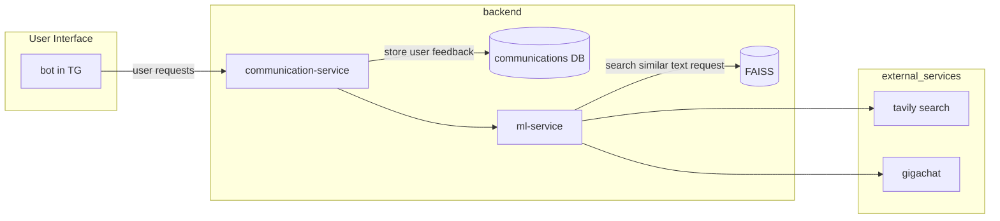

# Tourist agency consultant


#### Основные сценарии использования:  

1. Консультация по турам  
   - Бот отвечает на вопросы о направлениях, климате, визах и условиях поездок.  

2. Подбор тура  
   - Бот запрашивает параметры (страна, даты, бюджет) и предлагает подходящие варианты.  
   - Использует фильтры (тип отдыха, уровень сервиса).  

3. Оформление бронирования  
   - Клиент выбирает тур и получает инструкцию по бронированию и оплате.   

4. Уточнение деталей бронирования  
   - Клиент может запросить более подробную информацию по своему бронированию.  
   - Бот предоставляет расписание, условия проживания, включённые услуги.  

5. Отмена тура и возврат денег  
   - Клиент получает пошаговую инструкцию по отмене тура.  

6. Поддержка клиента  
   - Автоматические ответы на частые вопросы.   

7. Помощь с авиабилетами  
   - Бот предоставляет информацию о рейсах и помогает подобрать билет.  

8. Поиск маршрутов  
   - Клиент запрашивает маршрут от точки А до точки Б.  
   - Бот предлагает возможные маршруты, транспорт, время в пути.  

9. Достопримечательности и экскурсии  
   - Бот даёт информацию о туристических местах, их описание, отзывы.  

10. Визовые требования  
   - Бот предоставляет список необходимых документов для визы.  
   - Дает ссылку на официальные источники и инструкции.  

11. Действия при потере багажа  
   - Бот объясняет последовательность действий при потере багажа.  
   - Предоставляет контакты аэропорта. 

12. Изменение даты тура  
   - Бот проверяет возможность переноса даты.  

13. Оставить отзыв о работе бота  
   - Клиент может оценить работу бота (от 1 до 5).  
   - Оставить комментарий, предложения по улучшению.  

---


## Архитектура проекта

Схемка:

#### Команда для подключения к БД
```
psql "host=rc1a-tovlljfgcws5wj5h.mdb.yandexcloud.net,rc1b-2ijpl1ta0ep3wk3a.mdb.yandexcloud.net \
    port=6432 \
    sslmode=verify-full \
    dbname=communications \
    user=mirea_team \
    target_session_attrs=read-write"
```

ТГ бот на aiogram  
БД На postgresql  
TODO:  
1. разобраться с деплоем сервиса на севрере +
2. Разобраться с подключением к БД (и нужна ли она, и postgre ли нужна)  +
3. Разобраться с токеном ТГ бота (как прокинуть на сервер, чтобы не украли)


#### Развертка и запуск проекта
```
git clone git@github.com:Ed-Isakov/Tourist_agency_consultant.git
cd agent
vim .env # Вписать необходимые секреты для гигачата и поиска
cd ..
cd bot
vim .env # Вписать необходимые секреты для бота и бд
cd ..
docker compose up --build
```
