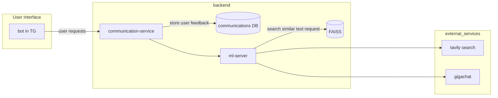

# Tourist agency consultant

## Требования к проекту

### Диаграмма вариантов использования для бота-консультанта турагентства  

#### Акторы (пользователи системы):  
1. Клиент – пользователь, который ищет информацию о турах, бронирует поездки, запрашивает помощь.  
2. Сотрудник турагентства – менеджер, который может обрабатывать сложные запросы, помогать клиентам.  
3. Система оплаты – внешний сервис, через который производится оплата туров.  
4. Внешние API (авиабилеты, отели, экскурсии, транспорт) – источники данных, откуда бот получает актуальную информацию.  

---

#### Основные сценарии использования:  

1. Консультация по турам  
   - Бот отвечает на вопросы о направлениях, климате, визах и условиях поездок.  

2. Подбор тура  
   - Бот запрашивает параметры (страна, даты, бюджет) и предлагает подходящие варианты.  
   - Использует фильтры (тип отдыха, уровень сервиса).  
   - Предоставляет фотографии, описание отелей, отзывы.  

3. Оформление бронирования  
   - Клиент выбирает тур и получает инструкцию по оплате.  
   - Бот отправляет подтверждение бронирования.  

4. Оплата тура  
   - Бот перенаправляет клиента в систему оплаты.  
   - Отправляет подтверждение успешной оплаты.  

5. Уточнение деталей бронирования  
   - Клиент может запросить более подробную информацию по своему бронированию.  
   - Бот предоставляет расписание, условия проживания, включённые услуги.  

6. Отмена тура и возврат денег  
   - Клиент получает пошаговую инструкцию по отмене тура.  
   - Бот передаёт запрос в службу поддержки или направляет к правилам возврата.  

7. Поддержка клиента  
   - Автоматические ответы на частые вопросы.  
   - Возможность подключения к сотруднику турагентства.  

8. Отправка уведомлений  
   - Напоминания о поездке, изменениях рейсов, выгодных предложениях.  

9. Помощь с авиабилетами  
   - Бот предоставляет информацию о рейсах и помогает подобрать билет.  

10. Поиск маршрутов  
   - Клиент запрашивает маршрут от точки А до точки Б.  
   - Бот предлагает возможные маршруты, транспорт, время в пути.  

11. Достопримечательности и экскурсии  
   - Бот даёт информацию о туристических местах.  
   - Возможность фильтрации по типу развлечений.  
   - Предоставление фотографий, описаний, отзывов.  

12. Визовые требования  
   - Бот предоставляет список необходимых документов для визы.  
   - Дает ссылку на официальные источники и инструкции.  

13. Действия при потере багажа  
   - Бот объясняет последовательность действий при потере багажа.  
   - Предоставляет контакты аэропорта.  

14. Изменение даты тура  
   - Бот проверяет возможность переноса даты.  
   - Пересчитывает стоимость с учетом изменения даты.  

15. Оставить отзыв о работе бота  
   - Клиент может оценить работу бота (от 1 до 5).  
   - Оставить комментарий, предложения по улучшению.  

---

### Связи между актёрами и вариантами использования:  
- Клиент взаимодействует со всеми основными функциями.  
- Сотрудник турагентства подключается в случае сложных запросов или изменений бронирования.  
- Система оплаты участвует в процессе оплаты.  
- Внешние API обеспечивают актуальные данные о билетах, отелях, маршрутах.  

## Архитектура проекта

Схемка:

ТГ бот на aiogram  
БД На postgresql  
TODO:  
1. разобраться с деплоем сервиса на севрере +
2. Разобраться с подключением к БД (и нужна ли она, и postgre ли нужна)  
3. Разобраться с токеном ТГ бота (как прокинуть на сервер, чтобы не украли)
