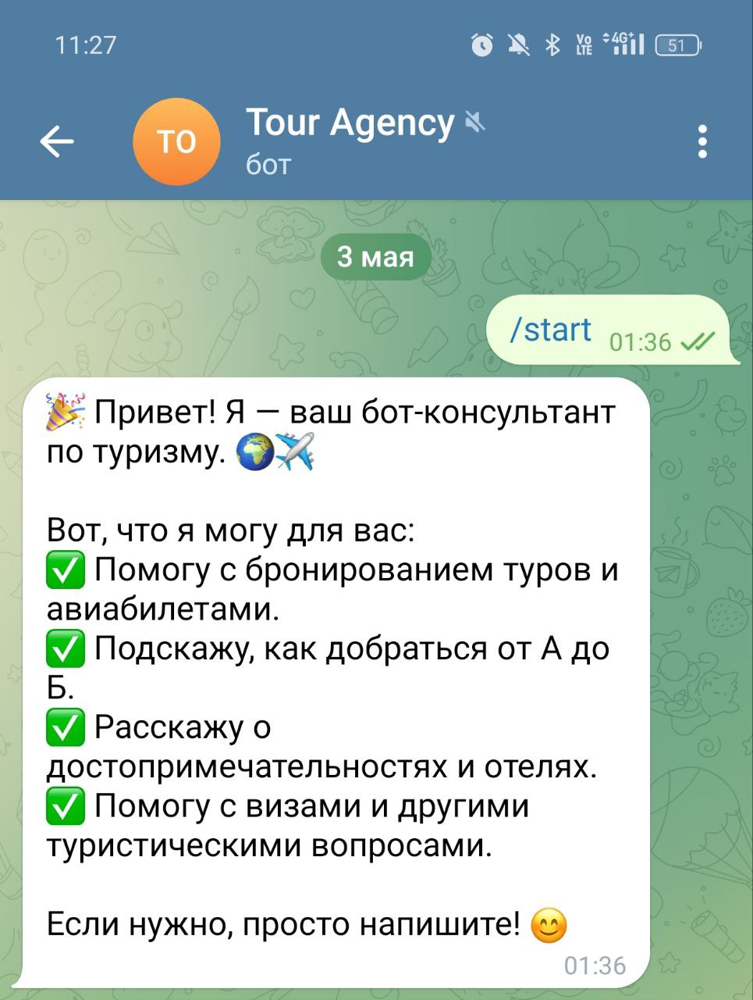
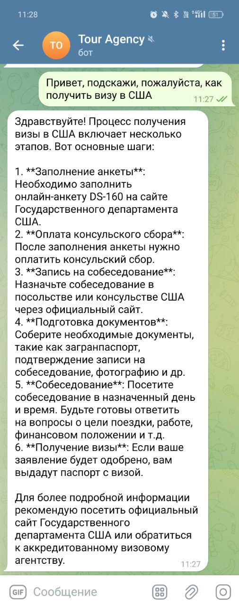
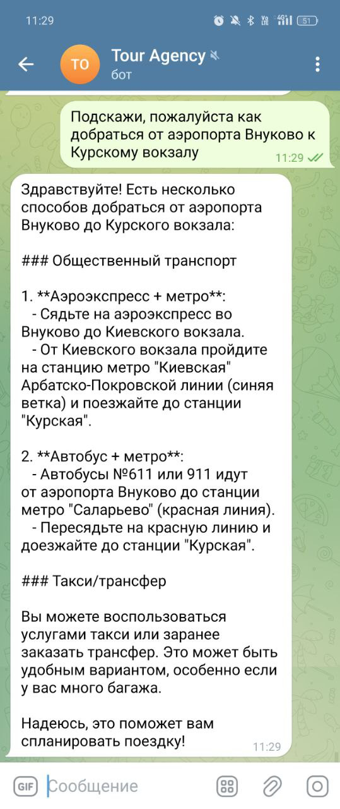
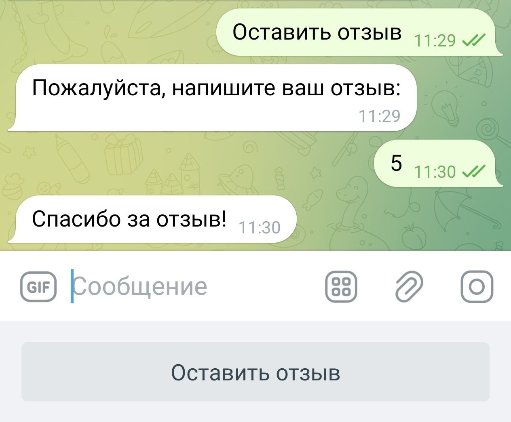

# Руководство пользователя

## Доступная функциональность

* **Подбор туров и авиабилетов**
* **Информация о достопримечательностях и отелях**
* **Консультации по визовым и иным туристическим вопросам**
* **Оставить отзыв** о работе бота через кнопку

## Начало работы

1. **Запустите приложение Telegram** на вашем устройстве.
2. **Найдите бота** по username`@tour_agency_projject_bot`.
3. Нажмите **Start** или отправьте команду `/start`, чтобы активировать бота.

## Как задать вопрос

1. После запуска бота **наберите текст** вашего запроса, например:
* Помогите подобрать тур в Италию на июль.
* Спросить, как изменить дату уже забронированного тура.
* Уточнить детали бронирования тура.
* Спросить, как отменить тур и вернуть деньги.
* Спросить о помощи с авиабилетами.
* Спросить, как добраться от точки А до точки Б.
* Спросить о достопримечательностях в определённом городе.
* Задать вопрос о необходимых документах для получения туристической визы.
* Спросить, что делать при потере багажа в аэропорту.
* Оставить отзыв о работе чат-бота.

2. Отправьте сообщение.
3. Бот ответит рекомендациями и подробной информацией.

## Как оставить отзыв

1. На основной клавиатуре нажмите кнопку **Оставить отзыв**.
2. В появившемся поле **введите текст** вашего отзыва и отправьте.
3. После сохранения вы получите подтверждение.

---

